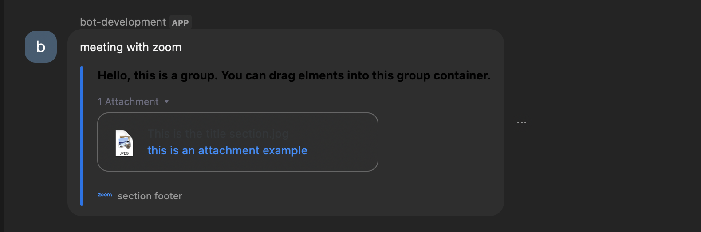

## Sample Zoom ChatBot

- Choose a Base API URL for the listener
- Open [Zoom Marketplace](https://marketplace.zoom.us/)
- Develop -> Build App
- In App Credentials, copy Client Id/Secret to `.env` file
- App Credentials > Redirect URL and Whitelist URL = `${Base URL}`/oauth/authorize from Step 1
- Information > Add Name, Short Description, Long Description 
- Information > Links: 
    - Privacy Policy URL = `${Base URL}`/privacy
    - Terms of Use URL = `${Base URL}`/terms
    - Support URL = `${Base URL}`/support
    - Documentation URL = `${Base URL}`/documentation
    - Configuration URL = `${Base URL}`/configure
- I chose install from marketplace, if you want to add a URL go for it!
- Deauthorization Notification = `${Base URL}`/oauth/revoke
- Feature > Add chatbot slash command and events as needed
    - Base Endpoint URL = `${Base URL}`/api 
- Scopes: 
    - For just chatbot, `imchat:bot` is enough
    - Additionally you can add scopes as needed
- Local Test: Install
- Once you get the zoom chat window, each message should be reaching `${Base URL}`/api

## Usage
In Zoom chat:
> /{command} arguments

Since I named my bot `/asridevbot` `/asridevbot hi` rendered the following results

 
